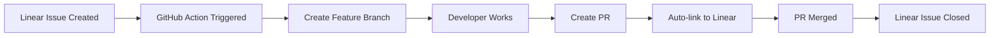

# ✅ Linear Integration Setup Complete

## What's Been Implemented

### 1. Core Integration ✅
- **Linear SDK Integration** (`lib/linear-integration.js`)
  - Full API wrapper for Linear operations
  - Pre-configured for your 10netzero team and BigSirFLRTS project
  - BMAD context generation for AI agents

### 2. CLI Tools ✅
- **Main CLI** (`scripts/linear-cli.js`)
  - `list` - List project issues
  - `create` - Create new issues
  - `get` - Get issue details
  - `sync-branch` - Sync from git branches
  - `cycle` - View current cycle

- **Setup Script** (`scripts/setup-linear.js`)
  - Interactive API key configuration
  - Automatic .env file management
  - Connection testing

- **Cycle Management** (`scripts/setup-linear-cycles.js`)
  - `create` - Create sprint cycles
  - `list` - View all cycles
  - `current` - Show current cycle details
  - `assign` - Assign issues to cycles

### 3. GitHub Actions Automation ✅
- **Linear Sync** (`.github/workflows/linear-sync.yml`)
  - Runs every 30 minutes
  - Creates branches for new issues
  - Updates PR descriptions
  - Syncs issue states

- **PR Automation** (`.github/workflows/linear-pr-automation.yml`)
  - Auto-enriches PRs with Linear context
  - Updates Linear when PRs are opened
  - Closes Linear issues when PRs merge

### 4. Documentation ✅
- Architecture guide (`docs/linear-integration.md`)
- Webhook options (`linear-webhook-generic.md`)
- Quick reference (`linear-integration-README.md`)
- BMAD integration (`/.bmad-core/integrations/linear-context.md`)

## Quick Start Commands

```bash
# View your issues
node scripts/linear-cli.js list

# Create a new issue
node scripts/linear-cli.js create "Implement user authentication" \
  -d "Add JWT-based auth to the API" \
  -p 2

# Get issue details
node scripts/linear-cli.js get 10N-86

# Set up sprint cycles
node scripts/setup-linear-cycles.js create -w 2 -c 6

# View current sprint
node scripts/setup-linear-cycles.js current

# Assign issue to current sprint
node scripts/setup-linear-cycles.js assign 10N-86
```

## GitHub Actions Setup

### Required Secrets

Add these to your GitHub repository secrets:

```bash
LINEAR_API_KEY=[YOUR_LINEAR_API_KEY]
LINEAR_TEAM_ID=YOUR_LINEAR_PROJECT_ID
LINEAR_PROJECT_ID=9d089be4-a284-4879-9b67-f472abecf998
```

Go to: Settings > Secrets and variables > Actions > New repository secret

### Testing Actions

1. **Manual Trigger**:
   ```bash
   gh workflow run linear-sync.yml
   ```

2. **View Runs**:
   ```bash
   gh run list --workflow=linear-sync.yml
   ```

## Workflow Overview



## Next Steps

### Immediate Actions
1. **Create Sprint Cycles**:
   ```bash
   node scripts/setup-linear-cycles.js create
   ```

2. **Add GitHub Secrets**:
   - Go to your repo settings
   - Add the three Linear secrets

3. **Test the Integration**:
   ```bash
   # Create test issue
   node scripts/linear-cli.js create "Test: Full integration" -d "Testing complete workflow"

   # Wait for sync (or trigger manually)
   gh workflow run linear-sync.yml

   # Check for new branch
   git fetch && git branch -r | grep linear
   ```

### Optional Enhancements

1. **Real-time Webhooks** (if needed):
   - Deploy webhook handler to Vercel/Netlify
   - Configure in Linear settings
   - See `linear-webhook-generic.md`

2. **Custom Workflows**:
   - Modify GitHub Actions for your team's process
   - Add more automation triggers
   - Integrate with deployment pipelines

3. **Team Training**:
   - Share CLI commands with team
   - Document your Linear workflow
   - Set up team conventions

## Project-Agnostic Design

This integration is designed to be reusable:

- **No hardcoded project details** in core logic
- **Environment-based configuration**
- **Generic GitHub Actions** that work with any repo
- **Flexible webhook options** for different hosting

To use in another project:
1. Copy the `lib`, `scripts`, and `.github` directories
2. Update environment variables
3. Run setup script
4. Configure GitHub secrets

## Success Metrics

Track these to ensure adoption:
- Issues created in Linear (not GitHub)
- Branches following naming convention
- PRs auto-linked to Linear
- Cycle velocity improving

## Support

- Linear API Docs: https://developers.linear.app
- GitHub Actions: https://docs.github.com/actions
- Your configuration is in `.env`

---

**🎉 Your Linear integration is complete and ready for production use!**

The system will now:
- Sync Linear issues to GitHub every 30 minutes
- Create branches automatically for assigned issues
- Enrich PRs with Linear context
- Close Linear issues when PRs merge
- Track sprint progress through cycles

Linear is now your Single Source of Truth for project management.