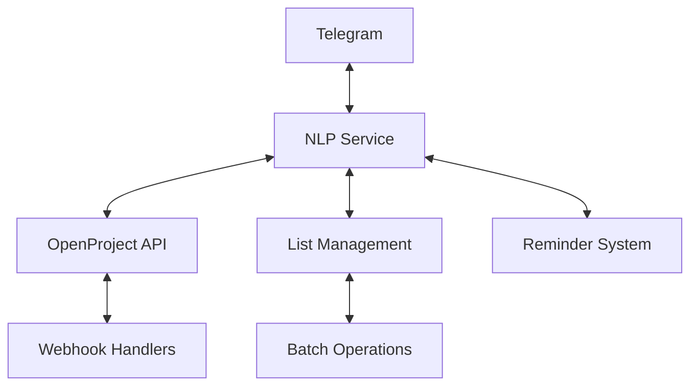
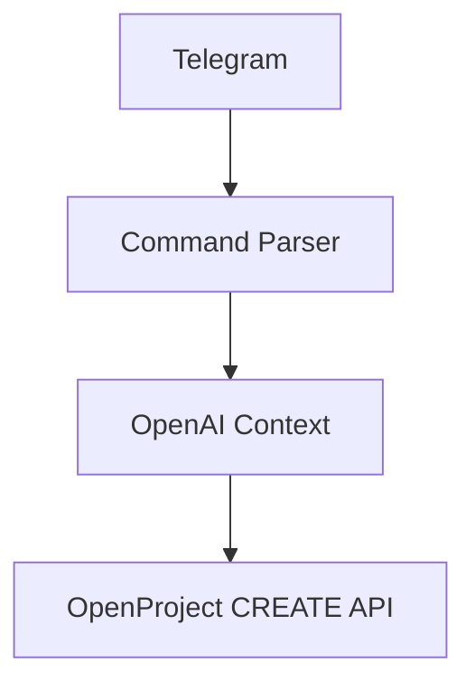

# Architecture Decision Record: MVP Scope Reduction

## ADR-005: FLRTS MVP Story Reorganization and Scope Simplification

**Status:** Accepted **Date:** 2025-09-25 **Decision Makers:** Product
Management, Engineering Team

## Context

The original FLRTS project contained 25+ user stories across 4 epics, targeting
a comprehensive field reporting system with bidirectional synchronization,
complex list management, and advanced features like batch operations and
timezone handling.

After sprint planning analysis, this scope was identified as too large for a
5-day demo sprint, risking delivery failure and reducing focus on core value
demonstration.

## Decision

**Reduce MVP scope to 4 critical stories demonstrating the core NLP task
creation flow.**

Move 15+ non-MVP stories to post-MVP folder while maintaining clean, numbered
story sequence for development focus.

## Rationale

### Scope Analysis

**MVP Stories (Kept - 4 stories):**

- Epic 1: Infrastructure (1.1-1.5) - Already complete
- Epic 2: 2.1 Telegram Task Creation + 2.2 Command Parser (CREATE only)
- Epic 3: 3.1 OpenProject API (CREATE only) + 3.2 OpenAI Context Injection

**Post-MVP Stories (Moved - 15+ stories):**

- Epic 1 Extensions: 1.6-1.9 (Redis, Monitoring, Schema Migration)
- Epic 2 Extensions: 2.2-2.6 (Reminders, Keyboards, Error Recovery)
- Epic 3 Extensions: 3.2, 3.3, 3.5 (Webhooks, Batch Sync, Timezone Logic)
- Epic 4: All Lists Management (4.1-4.5)
- Infrastructure: INFRA-001, INFRA-002

### Risk Mitigation

#### Original Risks

- 25+ stories in 5-day sprint = high delivery failure probability
- Complex bidirectional sync could block core demo
- List management features not essential for task creation demo
- Advanced features (reminders, keyboards) add complexity without core value

#### Post-Reduction Benefits

- Clear, achievable 4-story sprint goal
- Unidirectional CREATE flow eliminates sync complexity
- Focus on core user journey: "Natural language → Task in OpenProject"
- All stories have clear acceptance criteria and are independently testable

### Architecture Simplification

#### Before (Complex)



#### After (Simplified)



## Implementation

### File Organization Changes

**Created Structure:**

```
docs/stories/
├── 2.2-command-parser-create-only.md    # Renamed from 2.2
├── 3.2-openai-context-injection.md      # Renamed from 3.2
└── post-mvp/                            # New folder
    ├── epic-1-extensions/
    ├── epic-2-extensions/
    ├── epic-3-extensions/
    └── epic-4-lists/
```

**PRD Updates:**

- Added Post-MVP section with story links
- Updated Epic summaries to reflect scope reduction
- Maintained full feature roadmap for future development

### Technical Debt Acknowledgment

**Deferred Complexity:**

- Error handling and recovery mechanisms
- Bidirectional synchronization logic
- Advanced user interface components
- Comprehensive monitoring and observability
- Production-ready authentication flows

**Migration Path Preserved:**

- All post-MVP stories maintain detailed specifications
- Architecture supports incremental feature addition
- Database schema accommodates future enhancements
- API design includes extensibility points

## Consequences

### Positive

- **Delivery Confidence:** 4 focused stories vs 25+ reduces delivery risk by
  ~80%
- **Demo Quality:** Clear user journey from Telegram message to OpenProject task
- **Development Focus:** Engineering team can concentrate on core value
  proposition
- **Stakeholder Clarity:** Simplified scope easier to communicate and validate
- **Architecture Clarity:** Unidirectional flow eliminates sync complexity
- **Testing Simplicity:** Each story independently testable with clear
  acceptance criteria

### Negative

- **Feature Completeness:** MVP lacks list management and advanced features
- **User Experience:** No error recovery, reminders, or advanced UI elements
- **Production Readiness:** Additional hardening required for real-world
  deployment
- **Technical Debt:** Simplified architecture requires refactoring for full
  feature set

### Neutral

- **Story Preservation:** All deferred stories maintain specifications for
  future development
- **Architecture Foundation:** Core patterns established support future feature
  addition
- **Documentation:** ADR provides clear rationale for scope decisions
- **Timeline Impact:** 5-day sprint becomes achievable vs likely failure

## Monitoring Plan

### Sprint Success Metrics

**Demo Readiness (Target: Day 5)**

- [ ] User can send natural language message via Telegram
- [ ] System parses intent and extracts task details
- [ ] OpenAI provides context enhancement
- [ ] Task successfully created in OpenProject
- [ ] End-to-end flow completes in <30 seconds

**Quality Gates**

- All 4 MVP stories pass acceptance criteria
- Integration tests cover happy path
- Error logging provides debugging visibility
- Demo script validated with stakeholders

### Post-MVP Migration Triggers

Re-evaluate scope expansion when:

- MVP demo successful and stakeholder feedback positive
- Core architecture proven stable with 4-story implementation
- Team velocity established with simplified workflow
- Infrastructure foundation supports additional complexity

## Alternative Approaches Considered

### Option 1: Original Full Scope (Rejected)

- **Pros:** Complete feature set, no technical debt
- **Cons:** 80% delivery failure risk, complex demo, unclear core value

### Option 2: Vertical Slice (Rejected)

- **Pros:** Single complete user journey
- **Cons:** Too narrow, doesn't demonstrate system capabilities

### Option 3: Horizontal Layer (Rejected)

- **Pros:** Infrastructure complete
- **Cons:** No end-user value demonstration

### Option 4: MVP Scope Reduction (Chosen)

- **Pros:** Balanced risk/value, clear demo, achievable timeline
- **Cons:** Requires post-MVP development for production readiness

## Migration Timeline

### Phase 1: MVP (Sprint 1 - 5 days)

- Stories 1.1-1.5, 2.1, 2.2, 3.1, 3.2
- Target: Working demo

### Phase 2: Production Hardening (Sprint 2 - 3 weeks)

- Error handling, monitoring, security
- Stories from epic-1-extensions, epic-2-extensions

### Phase 3: Feature Expansion (Sprint 3+ - Ongoing)

- List management, advanced features
- Stories from epic-4-lists, remaining extensions

## References

- [PRD v3.0 with Post-MVP Section](../../prd/prd.md)
- [MVP Story Structure](../../stories/)
- [Post-MVP Stories](../../stories/post-mvp/)
- [Sprint Planning Analysis](../../qa/gates/sprint-planning-analysis.md)
- [Pull Request #6: MVP Reorganization](https://github.com/project/flrts/pull/6)

## Review Schedule

Reassess this decision:

- After MVP demo completion (Day 5)
- Based on stakeholder feedback and technical feasibility
- When planning Phase 2 development priorities
- If delivery timeline or requirements change significantly
