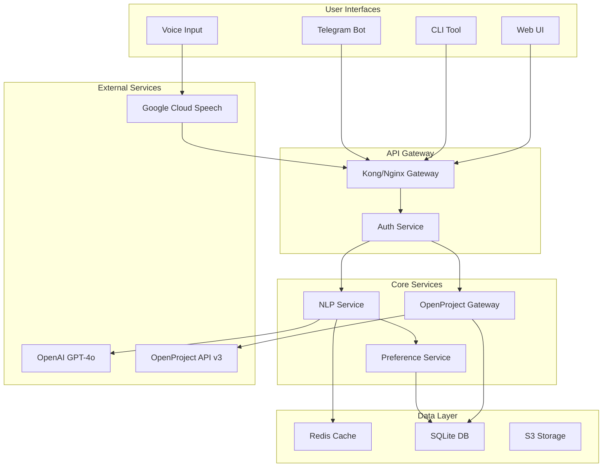
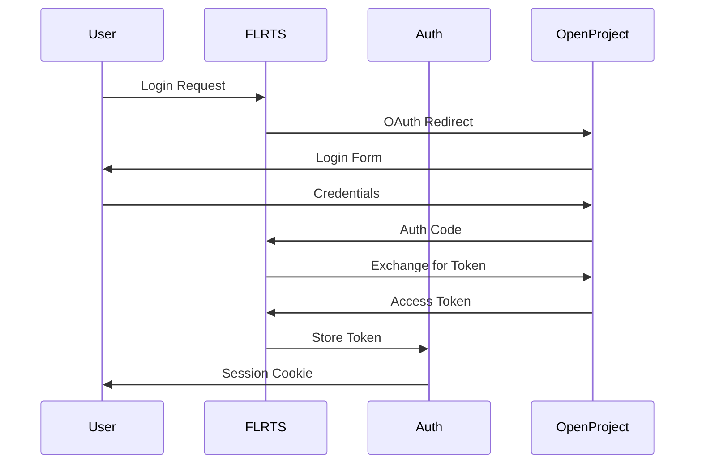

# FLRTS Technical Architecture Document

## Executive Summary

FLRTS (Fast Low-friction Repeatable Task System) is a microservices-based
natural language processing layer built on top of OpenProject. The architecture
prioritizes modularity, scalability, and maintainability while delivering
sub-200ms response times for task creation operations. The system leverages
OpenAI's GPT-4o for intent parsing, OpenProject's REST API v3 for task
management, and provides multiple interface channels including web, CLI, and
Telegram.

## Architecture Principles

1. **Single Responsibility**: Each service handles one core concern (NLP,
   OpenProject integration, UI delivery)
2. **API-First Design**: All functionality exposed through well-documented REST
   APIs
3. **Schema-Driven Development**: Zod schemas define contracts between services
4. **Fail-Safe Defaults**: Graceful degradation when external services
   unavailable
5. **Observability**: Comprehensive logging, metrics, and distributed tracing
6. **Security by Design**: Zero-trust architecture with encrypted communication

## High-Level System Architecture



## Service Architecture

### 1. NLP Service (Node.js/TypeScript)

**Responsibility**: Natural language parsing and intent extraction  
**Key Components**:

- OpenAI client with retry logic and circuit breaker
- Prompt template engine with version control
- Entity recognition for team members and dates
- Timezone conversion matrix (PST/CST/EST/UTC)
- Response caching for repeated queries

**API Endpoints**:

- `POST /parse` - Parse natural language to structured task
- `POST /validate` - Validate parsed structure before submission
- `GET /suggestions` - Get autocomplete suggestions

### 2. OpenProject Gateway Service (Node.js/TypeScript)

**Responsibility**: OpenProject API integration and data transformation  
**Key Components**:

- OpenProject API v3 client with pagination support
- Work package CRUD operations
- Custom field mapping for mining metadata
- Bulk operation handler with transaction support
- WebSocket connection for real-time updates

**API Endpoints**:

- `POST /workpackages` - Create work package
- `PUT /workpackages/:id` - Update work package
- `DELETE /workpackages/:id` - Delete work package
- `GET /workpackages` - List work packages with filters
- `GET /projects` - Get available projects
- `GET /users` - Get team members

### 3. Preference Service (Node.js/TypeScript)

**Responsibility**: User preferences and learning patterns  
**Key Components**:

- User timezone and locale management
- Usage pattern analytics
- Template storage and retrieval
- Shortcut configuration
- Privacy-compliant data handling

**API Endpoints**:

- `GET /users/:id/preferences` - Get user preferences
- `PUT /users/:id/preferences` - Update preferences
- `GET /templates` - Get saved templates
- `POST /analytics/events` - Track usage patterns

### 4. Authentication Service (Node.js/TypeScript)

**Responsibility**: Security and access control  
**Key Components**:

- OpenProject OAuth integration
- API key management
- Rate limiting per user/API key
- Audit logging
- Session management

## Data Models

### Core Schemas (Zod TypeScript)

```typescript
// Parsed Task Schema
const ParsedTaskSchema = z.object({
  operation: z.enum(['CREATE', 'UPDATE', 'DELETE', 'LIST']),
  workPackage: z.object({
    subject: z.string(),
    description: z.string().optional(),
    assigneeId: z.string(),
    projectId: z.string(),
    type: z.enum(['Task', 'Bug', 'Feature', 'Epic', 'UserStory']),
    dueDate: z.string().datetime(),
    priority: z.enum(['Low', 'Normal', 'High', 'Immediate']),
    customFields: z.record(z.any()).optional(),
  }),
  metadata: z.object({
    confidence: z.number().min(0).max(1),
    timezone: z.string(),
    originalInput: z.string(),
    parseTime: z.number(),
  }),
});

// Team Member Schema
const TeamMemberSchema = z.object({
  id: z.string(),
  name: z.string(),
  aliases: z.array(z.string()),
  timezone: z.enum(['PST', 'CST', 'EST']),
  openProjectId: z.string(),
  defaultProjects: z.array(z.string()),
});

// Mining Metadata Schema
const MiningMetadataSchema = z.object({
  facilityId: z.string(),
  equipmentType: z.enum(['ASIC', 'GPU', 'FPGA', 'Infrastructure']),
  maintenanceType: z.enum(['Preventive', 'Corrective', 'Emergency']),
  downtimeImpact: z.enum(['None', 'Partial', 'Full']),
  estimatedDuration: z.number().optional(),
});
```

## API Specifications

### RESTful API Design

All APIs follow REST principles with consistent patterns:

```yaml
Base URL: https://api.flrts.company
Version: v1
Authentication: Bearer token (OpenProject API key)

Common Headers:
  Content-Type: application/json
  X-Request-ID: uuid
  X-Timezone: user timezone

Rate Limits:
  - 100 requests/minute per user
  - 10 concurrent requests per user
  - 1000 tokens/minute for OpenAI calls

Error Format:
  {
    'error':
      {
        'code': 'PARSE_FAILED',
        'message': 'Unable to parse input',
        'details': {},
        'requestId': 'uuid',
      },
  }
```

### WebSocket Events

Real-time updates via WebSocket for collaborative features:

```typescript
// Client -> Server
interface ClientMessage {
  type: 'subscribe' | 'unsubscribe' | 'parse';
  payload: any;
}

// Server -> Client
interface ServerMessage {
  type: 'task_created' | 'task_updated' | 'parse_result';
  payload: any;
}
```

## Deployment Architecture

### Container Strategy

```yaml
# docker-compose.yml structure
version: '3.8'
services:
  nlp-service:
    image: flrts/nlp:latest
    replicas: 3
    resources:
      limits:
        memory: 512M
        cpu: '0.5'

  openproject-gateway:
    image: flrts/op-gateway:latest
    replicas: 2
    resources:
      limits:
        memory: 256M
        cpu: '0.25'

  redis:
    image: redis:7-alpine
    volumes:
      - redis-data:/data

  nginx:
    image: nginx:alpine
    configs:
      - source: nginx-config
      - target: /etc/nginx/nginx.conf
```

### Infrastructure Requirements

**Minimum Production Setup**:

- 2 vCPUs, 4GB RAM for application services
- 1 vCPU, 2GB RAM for Redis/SQLite
- 10GB SSD storage
- 100Mbps network bandwidth

**Recommended Production Setup**:

- Kubernetes cluster with 3 nodes
- Each node: 4 vCPUs, 8GB RAM
- Persistent volume for databases
- CDN for static assets
- Load balancer with SSL termination

### Scaling Strategy

1. **Horizontal Scaling**: NLP service scales based on request queue depth
2. **Vertical Scaling**: OpenProject Gateway scales based on API response time
3. **Caching Layer**: Redis scales based on memory usage
4. **Database Sharding**: SQLite migrations to PostgreSQL when >10GB

## Security Architecture

### Authentication Flow



### Security Controls

1. **Network Security**
   - All services communicate over TLS 1.3
   - Private subnet for internal services
   - WAF rules for common attacks

2. **Data Security**
   - Encryption at rest for databases
   - Encryption in transit for all APIs
   - PII redaction in logs

3. **Access Control**
   - RBAC based on OpenProject roles
   - API key rotation every 90 days
   - MFA for administrative access

4. **Compliance**
   - GDPR-compliant data handling
   - Audit logs retained for 1 year
   - Right to deletion implemented

## Monitoring & Observability

### Metrics (Prometheus)

- Request rate, error rate, duration (RED metrics)
- OpenAI token usage and costs
- Queue depths and processing times
- Cache hit rates

### Logging (ELK Stack)

- Structured JSON logs
- Correlation IDs across services
- Log levels: ERROR, WARN, INFO, DEBUG
- Sensitive data masking

### Tracing (OpenTelemetry)

- End-to-end request tracing
- Service dependency mapping
- Performance bottleneck identification
- Error propagation tracking

### Alerting Rules

- API response time > 500ms
- Error rate > 1%
- OpenAI quota > 80%
- Service health check failures

## Technology Stack Summary

| Component     | Technology           | Justification                                 |
| ------------- | -------------------- | --------------------------------------------- |
| Runtime       | Node.js 20 LTS       | TypeScript support, async performance         |
| Framework     | Express.js           | Mature, well-documented, middleware ecosystem |
| Validation    | Zod                  | Runtime type safety, schema generation        |
| Database      | SQLite → PostgreSQL  | Simple start, clear migration path            |
| Cache         | Redis                | Fast, supports pub/sub for real-time          |
| Queue         | Bull                 | Redis-backed, reliable job processing         |
| API Docs      | OpenAPI 3.0          | Industry standard, code generation            |
| Testing       | Jest + Supertest     | Comprehensive testing capabilities            |
| Container     | Docker               | Consistent deployment, easy scaling           |
| Orchestration | Kubernetes           | Production-grade container management         |
| Monitoring    | Prometheus + Grafana | Open-source, powerful visualization           |
| CI/CD         | GitHub Actions       | Integrated with repository, free tier         |
