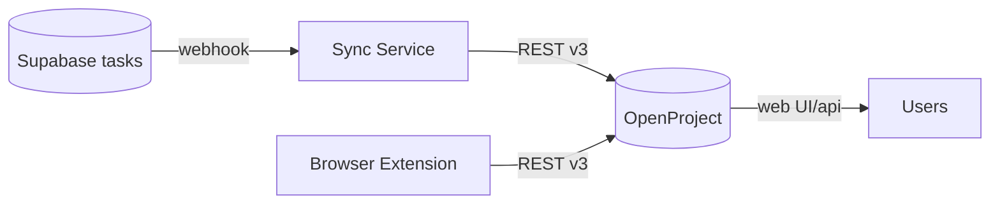

# FLRTS Architecture Audit – Living Log

This document tracks findings and decisions as we execute the seven‑module audit plan. It is updated incrementally per module.

Last updated: 2025-09-30

---

## Module 1 – Core Infrastructure & Configuration (Complete)

Artifacts:

- audit-results/infrastructure-connections.md
- audit-results/infrastructure-audit.json

Highlights:

- Services: openproject, flrts-nlp, memcached, n8n (local), cloudflared; monitoring stack (prometheus, grafana, jaeger, node-exporter, cadvisor)
- Networks: flrts_network, monitoring
- External deps: Supabase PostgreSQL, OpenAI API, Cloudflare R2, Cloudflare Tunnel

Key findings:

- CRITICAL: Hardcoded DB credentials and default admin/secret values present in docker compose variants (dev examples). Must replace with env vars or Docker secrets for any non-local use.
- ~~HIGH: TELEGRAM_BOT_URL referenced without a defined telegram-bot service in one compose; clarify or remove.~~ **RESOLVED (10N-165)**: Removed stale reference.
- MEDIUM: Ensure production binds to 127.0.0.1 with Cloudflare Tunnel; add CI lint to enforce.

Immediate recommendations:

- Remove hardcoded creds from compose; inject via GitHub/1Password secrets.
- Fail CI on committed DATABASE_URL/API patterns.
- Consider Docker secrets for highly sensitive values.

---

## Module 2 – OpenProject Integration Service (In Progress → Completed)

Scope:

- Enumerate OpenProject API usage and auth
- Validate endpoints against REST v3
- Identify schema coupling or drift
- Review error handling, retries, idempotency
- Produce module audit JSON (see audit-results/openproject-audit.json)

### Code References

- packages/sync-service/src/index.ts
  - POST /projects/:projectId/work_packages (create)
  - PATCH /work_packages/:id (update)
  - DELETE /work_packages/:id (delete)
  - Auth: Basic apikey:OPENPROJECT_API_KEY via axios.auth
  - Project selection: OPENPROJECT_PROJECT_ID = 3 (hardcoded)
  - Mapping helpers: mapPriority(), mapStatus() → numeric IDs
- packages/flrts-extension/content.js (browser context)
  - POST /api/v3/work_packages using stored API key (user context)
- database/migrations/002_openproject_schema.sql
  - Defines openproject.* tables and triggers syncing with public.tasks
- docs/architecture/api-contract.md
  - Principle: "FLRTS never writes directly to the database – all operations via REST API"

### Validation vs OpenProject REST v3

- Endpoints used are valid v3:
  - Create: POST /projects/:id/work_packages
  - Update: PATCH /work_packages/:id
  - Delete: DELETE /work_packages/:id
- Headers: content-type application/json present; auth via Basic apikey is correct.
- Suggest using pre-validation form endpoint for richer errors: POST /projects/:id/work_packages/form

### Findings

- HIGH: Hardcoded OPENPROJECT_PROJECT_ID = 3. Should be environment-configured (e.g., OPENPROJECT_PROJECT_ID) or resolved dynamically.
- MEDIUM: No retry/backoff or idempotency key for create/update; consider exponential backoff and safe retry (e.g., dedupe by external reference/custom field).
- MEDIUM: mapPriority/mapStatus rely on numeric IDs which vary per instance; prefer resolving IDs at startup (cache) or via config.
- LOW: Logs print prefixes of Supabase keys; avoid emitting any secret fragments in shared logs.
- ARCHITECTURAL: Mismatch between documented principle (API-only) and presence of DB schema + triggers for openproject.*. If migrations are in use, this introduces dual-write/consistency risks. Decide on single source of truth:
  - Option A (recommended): API-only integration; remove DB triggers and schema coupling used for syncing.
  - Option B: Database-side caching with clear boundary; ensure triggers cannot mutate OpenProject data (cache-only), document invariants.

### Recommendations

- Parameterize OPENPROJECT_PROJECT_ID via env; fail fast if missing.
- Introduce a small client wrapper with retries (e.g., axios-retry) and circuit breaker; add request correlation IDs.
- Resolve and cache dictionary IDs (status, priority, types) at startup; refresh periodically.
- Add preflight form call before creation to validate payload.
- Remove/disable DB triggers unless explicitly adopting a cache pattern; align with api-contract.md.

### Mermaid – Integration Map

Status: Completed. See audit-results/openproject-audit.json for structured details.

---

Next: Module 3 – NLP Service & AI Integration

- Audit OpenAI key handling, prompt safety, rate limiting, and cost tracking.
- Validate token accounting and backoff policies.

## Module 2 – Decision

Decision: Adopt API-only integration for OpenProject.

- Action: Deprecate DB triggers defined under `openproject.*` in migrations; if a cache is desired, implement via API sync jobs with explicit boundaries, not database triggers.
- Follow-ups: Parameterize project ID; resolve and cache dictionary IDs; add retries/backoff and idempotency; remove secret-prefix logs.

## Module 3 – NLP Service & AI Integration (Completed)

Artifacts:

- audit-results/nlp-audit.json

Highlights:

- OpenAI via SDK `chat.completions.parse` with Zod structured outputs; model: `gpt-4o-2024-08-06`.
- Inputs validated by `ParseRequestSchema`; outputs validated by `validateParsedTask`.
- Logging: Winston + OTel; key length only (no key content).

Key findings:

- HIGH: No explicit timeout/retry/backoff on OpenAI calls.
- MEDIUM: No token/cost tracking; add usage metrics.
- MEDIUM: Inputs and reasoning stored in Supabase without redaction policy; define retention/PII policy and ensure RLS.
- LOW: Model selection hardcoded; parameterize.
- LOW: Using anon key for logging writes; prefer service role or controlled function.

Recommendations:

- Add AbortController timeout, exponential backoff with jitter, and circuit breaker.
- Track token usage/cost; emit OTel metrics.
- Redaction + retention policy; verify RLS.
- Env-driven model/temperature.
- Use service role or secure write path.

---

Next: Module 4 – Telegram Bot Service

- Map commands and handlers; validate webhook security, session mgmt, and rate limiting.
- Produce audit-results/telegram-audit.json and update this log.

## Module 4 – Telegram Bot Service (Completed)

Artifacts:

- audit-results/telegram-audit.json

Highlights:

- Supabase Edge Function validates Telegram webhook secret header; immediate 200 responses with fire-and-forget ack to avoid retries.
- Optional queue to n8n via N8N_WEBHOOK_URL for async processing.
- Nginx rate limiting applied to /webhook/ paths for n8n ingress.

Key findings:

- MEDIUM: n8n webhook queueing lacks request signing/authentication.
- LOW: No app-level rate limiting at edge (rely on Telegram + secret token).
- LOW: Logging user metadata requires explicit retention/RLS policies.

Recommendations:

- Sign n8n webhook requests (HMAC) and validate in n8n.
- Add lightweight edge rate limiting as defense-in-depth.
- Define retention policy and RLS for Telegram logs; mask if not required.

---

Next: Module 5 – n8n Workflow Automation

- Extract webhook endpoints, map triggers, validate error handling and loop risks.
- Produce audit-results/n8n-audit.json and update this log.

## Module 5 – n8n Workflow Automation (Completed)

Artifacts:

- audit-results/n8n-audit.json

Highlights:

- Queue mode enabled (Bull/Redis) with separate worker; encryption key configured; WEBHOOK_URL required.
- Monitoring templates for webhook responses, metrics collection, and error handling exist.

Key findings:

- MEDIUM: Webhook endpoints lack request authentication/signature (pair with HMAC or Basic/Auth validation).
- MEDIUM: No DLQ-like pattern documented for repeatedly failing executions in queue mode.
- LOW: Workers lack explicit CPU/memory limits in compose.
- LOW: Missing explicit workflow-level retry/backoff policies for downstream calls.

Recommendations:

- Enforce webhook authentication (HMAC) and validate on first node.
- Document failure handling path (retries, caps, alerting) and add a DLQ-like review workflow.
- Add container resource limits for n8n-main and workers.
- Define idempotency and retry policies for external calls.

---

Next: Module 6 – Supabase Integration Layer

- Audit client usage, pooling, RLS policies, and transaction boundaries.
- Produce audit-results/supabase-audit.json and update this log.

## Module 6 – Supabase Integration Layer (Completed)

Artifacts:

- audit-results/supabase-audit.json

Highlights:

- Auth site_url is set to localhost (dev); Google provider enabled.
- No storage buckets configured (Cloudflare R2 used elsewhere).
- Edge functions use service role (ok); some server code uses anon key for writes.
- Monitoring views granted to authenticated role.

Key findings:

- HIGH: RLS not defined for sensitive tables (tasks, audit/logging/queue tables).
- MEDIUM: Missing migrations for tables referenced by code (parse_logs, parse_queue, telegram_webhook_logs).
- MEDIUM: Auth site_url set to localhost; wrong links in production.
- LOW: Monitoring views exposed to authenticated users.

Recommendations:

- Enable RLS + policies for tasks, logs, and queue tables; restrict anon.
- Add migrations for missing tables and align code with schema.
- Set site_url to production URL; review uri_allow_list.
- Limit monitoring view access to admin roles or secure RPC.

---

Next: Module 7 – Frontend & API Gateway

- Extract API endpoints, validate auth/CORS, audit WS security and input validation.
- Produce audit-results/frontend-api-audit.json and update this log.

## Module 7 – Frontend & API Gateway (Completed)

Artifacts:

- audit-results/frontend-api-audit.json

Highlights:

- Express services (NLP and Sync) expose public endpoints; minimal middleware.
- Edge function (parse-request) sets permissive CORS for browser access.

Key findings:

- MEDIUM: CORS wide open (*) on edge parse-request and NLP service.
- MEDIUM: Unauthenticated endpoints exposed (/history, parse path); missing JWT/RBAC.
- LOW: No rate limiting on Express services.
- LOW: Missing Helmet/security headers on Express services.

Recommendations:

- Constrain CORS to allowlisted domains by env; keep '*' only for dev.
- Add JWT middleware + role checks; hide /history or require admin.
- Add rate-limiter-flexible with IP+user buckets; set request size limits.
- Add Helmet with strict defaults and standardize error responses.

---

All audit modules completed. Next: compile final summary and remediation roadmap.
