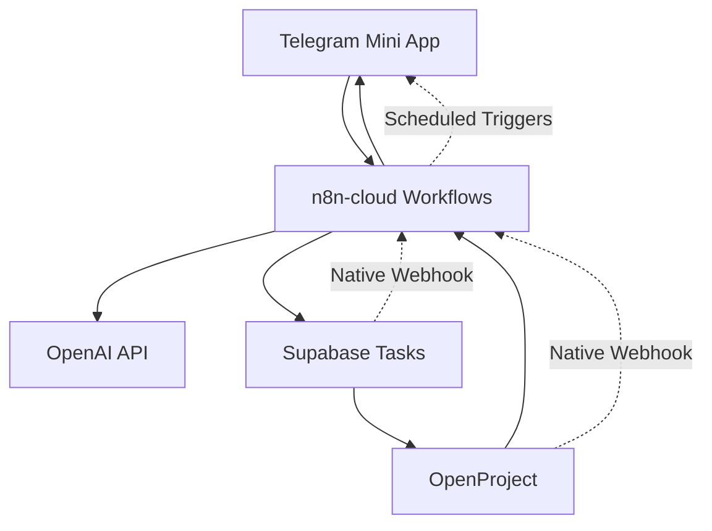

# MVP Architecture - Telegram Task App

## Architecture Overview

This document defines the cloud-first, tool-native architecture for the Telegram Task App MVP. The core principle is **leverage existing tools and services** rather than building custom solutions.

## Core Principles

### 1. Tool-First Approach
- **Default**: Use n8n workflows for integrations
- **Exception**: Custom code only if ≤10 lines AND significantly more performant
- **Preference**: Native webhooks over polling, MCP tools over custom APIs

### 2. Cloud-Native Deployment
- **Everything hosted**: No local dependencies or infrastructure
- **Cloudflare-first**: Workers, Wrangler deployment, Cloudflare DBs
- **Managed services**: n8n-cloud, Supabase, OpenAI API

### 3. Reliability Over Performance
- **MVP focus**: Working system over optimized system
- **Error handling**: Built-in retry logic and monitoring
- **Data integrity**: Supabase as single source of truth

## System Architecture

### High-Level Components



### Component Details

#### Telegram Mini App (Cloudflare Workers)
- **Purpose**: User interface for natural language task input
- **Technology**: Telegram Bot API + Mini App framework
- **Hosting**: Cloudflare Workers
- **Features**: 
  - Natural language text input
  - Task creation confirmations
  - Reminder notifications
  - List management commands

#### n8n-cloud (Hosted Automation)
- **Purpose**: All integration logic and workflows
- **Technology**: n8n-cloud instance (MCP available)
- **Key Workflows**:
  1. Telegram Input → OpenAI → Supabase
  2. Supabase Webhook → OpenProject Sync  
  3. OpenProject Webhook → Supabase Sync
  4. Scheduled Reminder → Telegram Notifications
- **Features**:
  - Error handling and retries
  - Webhook endpoints
  - Scheduled triggers
  - Monitoring and logging

#### OpenAI Integration (API + MCP)
- **Purpose**: Natural language parsing and task assignment
- **Technology**: OpenAI API via MCP tools
- **Features**:
  - Task detail extraction from natural language
  - Employee assignment using hardcoded list
  - Due date parsing and timezone handling
  - Task classification and prioritization

#### Supabase (Existing)
- **Purpose**: Single source of truth for task data
- **Technology**: Supabase with native webhooks
- **Schema**: Focus on `tasks` table only for MVP
- **Features**:
  - Native webhook triggers on INSERT/UPDATE/DELETE
  - Real-time sync capabilities
  - Task and list storage
  - User assignment tracking

#### OpenProject (Cloudflare Deployment)
- **Purpose**: Project management visualization and mature task backend
- **Technology**: OpenProject deployed via Wrangler
- **Features**:
  - Work package management
  - Gantt charts and project views
  - Native webhook support
  - Due date and reminder management
  - API for bidirectional sync

#### Cloudflare DBs
- **Purpose**: LLM context storage and caching
- **Technology**: Cloudflare D1 or KV storage
- **Features**:
  - Employee list and assignment patterns
  - User preferences and history
  - Workflow state management
  - Performance caching

## Data Flow Architecture

### Task Creation Flow
```
1. User types in Telegram: "Remind Colin to review the budget by Friday 3pm"
2. Telegram Mini App → n8n webhook
3. n8n → OpenAI API (parse text + hardcoded employee matching)
4. OpenAI response → n8n (structured task data)
5. n8n → Supabase (create task record)
6. Supabase webhook → n8n (task created event)
7. n8n → OpenProject API (create work package)
8. n8n → Telegram (confirmation message)
```

### Reminder Flow
```
1. n8n scheduled trigger (every 15 minutes)
2. n8n → OpenProject API (query due/overdue tasks)
3. OpenProject → n8n (task list with assignments)
4. n8n → Telegram API (send reminder messages)
5. n8n → Supabase (update reminder status)
```

### Bidirectional Sync Flow
```
OpenProject Status Change:
1. User marks task complete in OpenProject
2. OpenProject webhook → n8n
3. n8n → Supabase (update task status)
4. n8n → Telegram (optional notification)

Supabase Task Update:
1. Direct task update in Supabase
2. Supabase webhook → n8n  
3. n8n → OpenProject API (sync changes)
```

## Technology Stack

### Primary Services
| Component | Service | Hosting | MCP Available |
|-----------|---------|---------|---------------|
| Workflows | n8n-cloud | Cloud | ✅ Yes |
| Tasks DB | Supabase | Cloud | ✅ Yes |
| Project Mgmt | OpenProject | Cloudflare | 🔲 CLI |
| NLP | OpenAI | API | ✅ Yes |
| UI | Telegram Bot | Cloudflare Workers | 🔲 API |
| Storage | Cloudflare D1/KV | Cloudflare | 🔲 Wrangler |

### MCP Tools Used
- `mcp__n8n-cloud__*` - n8n workflow management
- `mcp__supabase__*` - Database operations and webhook setup
- `mcp__openai__*` - Natural language processing
- OpenProject CLI - Project and webhook configuration

## MVP Limitations & Constraints

### Intentional Limitations
- **Single entity sync**: Only `tasks` table, no users/sites/reports
- **Hardcoded employees**: No user management system
- **Basic lists**: Simple filtering and bullet lists only
- **Telegram only**: No web UI or other interfaces
- **Limited customization**: Focus on working system over features

### Technical Constraints
- **n8n-cloud quotas**: Monitor execution limits
- **OpenAI rate limits**: Implement queuing if needed
- **Telegram API limits**: Rate limiting on notifications
- **Cloudflare Workers limits**: Memory and execution time constraints

### Acceptable Trade-offs
- **Latency vs Reliability**: Favor reliable webhooks over instant responses
- **Features vs Speed**: 2-week delivery over comprehensive features
- **Customization vs Maintenance**: Use tools as-is rather than extensive configuration

## Security Considerations

### API Security
- All API keys stored in environment variables
- Webhook endpoints with signature verification
- No sensitive data in logs or error messages

### Data Privacy
- Task data encrypted in transit and at rest
- No personal data beyond task assignments
- Telegram data handling per their privacy policy

### Access Control
- Telegram bot token security
- OpenProject API key management
- Supabase RLS policies (if needed)

## Deployment Strategy

### Environment Setup
1. **Cloudflare**: Wrangler CLI configured
2. **n8n-cloud**: Workflows imported and activated
3. **Supabase**: Webhooks configured to n8n endpoints
4. **OpenProject**: Deployed to Cloudflare, webhooks configured
5. **Telegram**: Bot registered, Mini App configured

### Configuration Management
- Environment variables for all API keys
- n8n workflows version controlled
- OpenProject configuration via CLI scripts
- Cloudflare Workers deployed via Wrangler

### Monitoring & Observability
- n8n workflow execution logs
- Cloudflare Workers analytics
- Supabase webhook delivery status
- OpenProject API response monitoring
- Telegram bot interaction metrics

## Scaling Considerations (Post-MVP)

### Performance Bottlenecks
- OpenAI API rate limits → implement caching/queuing
- n8n execution limits → move to self-hosted if needed  
- Webhook reliability → add retry and dead letter queues
- Cloudflare Workers cold starts → optimize or pre-warm

### Feature Expansion
- Additional Supabase tables → extend existing workflows
- User management → add authentication and user table sync
- Advanced NLP → more sophisticated OpenAI prompts
- Web interface → Cloudflare Pages deployment

## Success Metrics

### Technical Metrics
- **Uptime**: >99% availability for core workflows
- **Latency**: <5 seconds for task creation end-to-end
- **Reliability**: <1% data loss or sync failures
- **Error Rate**: <5% workflow execution failures

### Business Metrics
- **User Adoption**: Daily active users creating tasks
- **Task Completion**: Tasks being marked complete via either system
- **User Satisfaction**: Positive feedback on Telegram interface
- **System Usage**: Regular use of reminders and lists

---

*Architecture designed for rapid MVP delivery with clear post-MVP scaling path*
*Focus: Tool leverage over custom development*