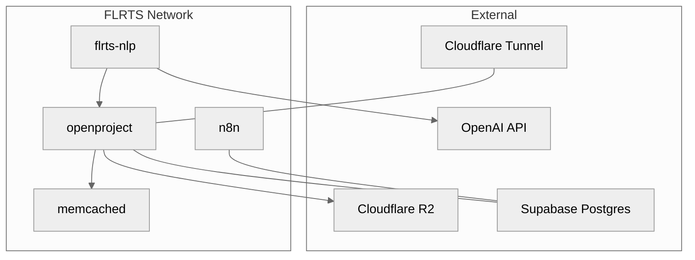

# Infrastructure Connections Map

Summary of services, ports, networks, and external dependencies discovered
across docker-compose files and CI/CD workflows.

## Services and Ports

- openproject
  - Ports: 8080->80 (root compose), 127.0.0.1:8080->80 (prod)
  - Network: flrts_network
  - Depends on: memcached (and openproject-db in prod)
- flrts-nlp
  - Ports: 3000->3000
  - Network: flrts_network
  - Depends on: openproject
- n8n
  - Ports: 5678->5678 (optional / local)
  - Network: flrts_network (root); dedicated networks in local n8n stacks
  - DB: Supabase Postgres (prod) or local Postgres (dev)
- memcached
  - Ports: none exposed
  - Network: flrts_network
- cloudflared
  - Ports: none exposed
  - Network: flrts_network
- Monitoring stack (local/dev)
  - prometheus: 9090->9090
  - grafana: 3000->3000
  - jaeger: 16686->16686, 14250->14250, 4317->4317, 4318->4318
  - node-exporter: 9100->9100
  - cadvisor: 8080->8080
  - Network: monitoring (local) / flrts_network (prod monitoring)

## External Dependencies

- Supabase PostgreSQL (production): ${SUPABASE_HOST}:5432
- OpenAI API: model configurable via OPENAI_MODEL (default gpt-4o)
- Cloudflare R2: S3-compatible via fog
- Cloudflare Tunnel: cloudflared

## Mermaid Connection Map

## Notable Findings

- Root compose exposes openproject (8080) and nlp-service (3000) on all
  interfaces. In production DO config, ports are bound to 127.0.0.1 (safer) and
  fronted by Cloudflare Tunnel.
- ~~flrts-nlp references TELEGRAM_BOT_URL=<http://telegram-bot:3001>, but no
  telegram-bot service is defined in the root compose. Verify deployment plan
  for the Telegram bot.~~ **RESOLVED (10N-165)**: Stale TELEGRAM_BOT_URL
  reference removed. Telegram integration is implemented as Supabase Edge
  Function.
- Monitoring ports are publicly exposed in local/dev stacks; in prod monitoring
  compose, ports bind to 127.0.0.1 (safer).

## Files Analyzed

- docker-compose.yml (root)
- infrastructure/docker/docker-compose.yml (n8n queue, local)
- infrastructure/docker/docker-compose.monitoring.yml (local)
- infrastructure/docker/docker-compose.single.yml (n8n single, local)
- infrastructure/digitalocean/docker-compose.prod.yml (prod)
- infrastructure/digitalocean/docker-compose.monitoring.prod.yml (prod
  monitoring)
- infrastructure/digitalocean/docker-compose.supabase.yml (prod alt using
  Supabase)
- .github/workflows/\* (QA gate, tests, Linear automation)
