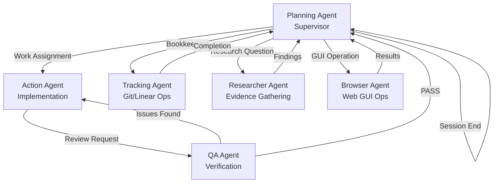

# Agent Handoff Rules

**Purpose**: Define the file-based handoff architecture for agent-to-agent communication in the BigSirFLRTS multi-agent workflow.

**Related Documents**:
- [agent-addressing-system.md](agent-addressing-system.md) - Standard format for addressing
- [scratch-and-archiving-conventions.md](scratch-and-archiving-conventions.md) - Scratch directory usage

---

## Handoff Workflow Overview

The BigSirFLRTS workflow uses a **file-based handoff system** where:
1. Agents write handoffs to predetermined file locations
2. User triggers the next agent invocation
3. Next agent reads intake from predetermined location
4. Agents ALWAYS return control to Planning Agent (supervisor pattern)

### Complete Handoff Chain



### Handoff Flow Rules

**CRITICAL RULES**:
1. **Action → QA** (ALWAYS after production code)
2. **QA → Action** (if issues found, retry loop until PASS)
3. **QA → Planning** (if PASS, return control to supervisor)
4. **Planning → Tracking** (large updates only, e.g., git/Linear bookkeeping)
5. **Planning → Researcher** (evidence gathering only, no code)
6. **Planning → Browser** (GUI operations, dashboard navigation, app installation)
7. **Researcher → Planning** (ALWAYS return to supervisor)
8. **Tracking → Planning** (ALWAYS return to supervisor)
9. **Browser → Planning** (ALWAYS return to supervisor with screenshots/results)
10. **Planning → Planning** (session handoff, read at start/overwrite at end)

**10N-275 EXCLUSIVE AUTHORITY**: Only the Planning Agent may update Linear issue 10N-275 (Master Dashboard). All other agents update their assigned work-block issues only.

---

## File-Based Handoff Architecture

### Standard Location Pattern
```
docs/.scratch/<issue-id>/handoffs/
```

### Naming Convention
```
{source-agent}-to-{target-agent}-{context}.md
```

**Examples**:
- `action-to-qa-review-request.md`
- `qa-to-action-retry.md`
- `qa-to-planning-pass.md`
- `planning-to-tracking-instructions.md`
- `planning-to-researcher-question.md`
- `planning-to-browser-instructions.md`
- `researcher-to-planning-findings.md`
- `tracking-to-planning-complete.md`
- `browser-to-planning-results.md`

**Exception**: Planning Agent session handoff uses fixed location:
- `docs/prompts/reference_docs/planning-handoff.md`

### Handoff File Structure

Each handoff file follows this structure:

1. **Header**: Agent addressing (see agent-addressing-system.md)
2. **Metadata**: Issue ID, dates, context
3. **Content**: Structured sections specific to handoff type
4. **Next Steps**: Clear action required from receiving agent

---

## Concurrency Guardrails ("Stay-in-Lane" Policy)

**Purpose**: Prevent conflicts and context pollution when multiple agents are active.

### Rules

1. **Single Work Item Per Agent**
   - Each agent works on ONE work-block issue at a time
   - No parallel work by the same agent type
   - Planning Agent coordinates all work assignments

2. **Strict Scope Boundaries**
   - Action Agent: Implementation ONLY (no QA, no bookkeeping)
   - QA Agent: Verification ONLY (no implementation, no Linear updates)
   - Tracking Agent: Git/Linear operations ONLY (no code, no decisions)
   - Researcher Agent: Evidence gathering ONLY (no code, no implementation decisions)
   - Browser Agent: GUI operations ONLY (no code, no strategic decisions, no Linear updates)
   - Planning Agent: Coordination ONLY (no code execution)

3. **Handoff Timing**
   - Complete current work item fully before starting next
   - Write handoff IMMEDIATELY when ready to hand off
   - Do NOT continue work after writing handoff

4. **10N-275 Single-Writer Guarantee**
   - ONLY Planning Agent updates 10N-275
   - All other agents update their assigned issues
   - If agent needs 10N-275 updated, hand off to Planning with request

---

## Error Handling

### Missing Handoff File

**When**: Agent expected intake handoff but file doesn't exist

**Action**:
1. Check alternative locations (`docs/.scratch/<issue>/` root, older naming conventions)
2. If not found, report to Planning Agent:
   ```
   BLOCKER: Expected handoff file not found.
   - Expected: docs/.scratch/10n-xxx/handoffs/{source}-to-{target}-{context}.md
   - Issue: 10N-XXX
   - Source agent: {expected source}
   - Request: Planning Agent to provide context or trigger source agent
   ```
3. DO NOT proceed without intake context

### Malformed Handoff Content

**When**: Handoff file exists but content is incomplete/malformed

**Action**:
1. Document specific missing fields or formatting issues
2. Report to Planning Agent with specific gaps:
   ```
   ISSUE: Handoff file malformed.
   - File: docs/.scratch/10n-xxx/handoffs/{file}.md
   - Missing: [list required sections]
   - Readable content: [summarize what IS present]
   - Request: Clarification from {source agent} or Planning Agent
   ```
3. If critical information is present, proceed with caution and note assumptions

### Conflicting Instructions

**When**: Handoff instructions conflict with Linear issue or other documentation

**Action**:
1. Assume **Linear issue description** is source of truth
2. Report discrepancy to Planning Agent:
   ```
   CONFLICT: Handoff differs from Linear.
   - Issue: 10N-XXX
   - Handoff says: [summary]
   - Linear says: [summary]
   - Action taken: Following Linear, flagging discrepancy
   ```

---

## Handoff Templates

### 1. Action→QA Review Request

**File**: `docs/.scratch/<issue>/handoffs/action-to-qa-review-request.md`
**When**: Action Agent completes production code delivery

```markdown
# Action Agent → QA Agent: Review Request

**Issue**: 10N-XXX
**Branch**: `feature/10n-xxx-description`
**Completion Date**: YYYY-MM-DD

## Deliverables
- [ ] List of files changed with key modifications
- [ ] Commit hash(es): `abc123`, `def456`
- [ ] Tests added/updated: list specific test files

## Validation Performed
- [ ] `npm run test:unit` - PASS/FAIL (counts, timing)
- [ ] `tsc --noEmit` - PASS/FAIL
- [ ] Security script - PASS/FAIL (note any warnings)
- [ ] Linter - PASS/FAIL

## External APIs Used
- API/endpoint validated: Yes/No
- Validation method: curl/spec citation
- Auth header format confirmed: Yes/No

## Scratch Artifacts
- Research notes: docs/.scratch/10n-xxx/research.md
- Prototype location: docs/.scratch/10n-xxx/prototype/
- Lessons draft: docs/.scratch/10n-xxx/lessons-draft.md

## Acceptance Criteria Status
- [x] Criterion 1 - met via files X, Y
- [x] Criterion 2 - met via test Z
- [ ] Criterion 3 - deferred to 10N-YYY (if applicable)

## Known Issues / Follow-ups
- None / List any known limitations

## Next Steps
Ready for QA review. Please verify against Linear issue 10N-XXX acceptance criteria.
```

---

### 2. QA→Action Retry

**File**: `docs/.scratch/<issue>/handoffs/qa-to-action-retry.md`
**When**: QA finds issues requiring Action Agent fixes

```markdown
# QA Agent → Action Agent: Issues Found - Retry Required

**Issue**: 10N-XXX
**Branch**: `feature/10n-xxx-description`
**Review Date**: YYYY-MM-DD

## Issues Found

### Critical Issues (Must Fix)
1. [Issue description]
   - Location: file.ts:line
   - Expected: [behavior]
   - Actual: [behavior]
   - Fix required: [specific action]

### Major Issues (Should Fix)
1. [Issue description]
   - Location: file.ts:line
   - Concern: [reason]
   - Suggested fix: [action]

### Minor Issues (Consider Fixing)
1. [Issue description]
   - Location: file.ts:line
   - Note: [observation]

## Test Failures
- Test file: test.spec.ts
- Failure: [description]
- Expected vs Actual: [details]

## Red Flags Observed
- [ ] Tests weakened (fewer assertions, removed edge cases)
- [ ] Disabled tests (skip/only/todo) without documentation
- [ ] Security warnings suppressed without justification
- [ ] Other: [description]

## Missing Requirements
- Acceptance criterion X not met: [details]
- Documentation missing: [what's needed]
- Standards violation: [which standard, how violated]

## Next Steps
Please address critical and major issues, then write new review request handoff when ready.
```

---

### 3. QA→Planning PASS

**File**: `docs/.scratch/<issue>/handoffs/qa-to-planning-pass.md`
**When**: QA validates all requirements met

```markdown
# QA Agent → Planning Agent: PASS - Work Validated

**Issue**: 10N-XXX
**Branch**: `feature/10n-xxx-description`
**Review Date**: YYYY-MM-DD

## Verdict
✅ **READY TO MERGE** - All acceptance criteria met, no blocking issues found.

## Verification Summary
- [x] Branch matches issue scope
- [x] Diff reviewed - no red flags
- [x] Claude MCP review executed - findings: [none/addressed]
- [x] Tests executed - PASS (counts, timing)
- [x] Security script - PASS / warnings justified
- [x] Documentation verified
- [x] Lessons Learned present in Linear

## Test Results
- `npm run test:unit`: PASS (X tests, Y seconds)
- ERPNext path: PASS/SKIPPED (reason)
- Feature flags: PASS (USE_ERPNEXT ON/OFF both green)

## Security Review
- Security script: PASS / X findings (all justified in .security-ignore)

## Standards Compliance
- [x] ERPNext Migration Naming Standards followed
- [x] ADR-006 patterns implemented correctly
- [x] HTTP retry checklist complete
- [x] Secret masking policy enforced
- [x] Logging guards in place

## Deliverables Verified
- Files changed: [list with line refs]
- Commits: [hashes with messages]
- Linear updated: Description checklists + closure comment

## Follow-up Actions (if any)
- None / List any non-blocking follow-ups

## Recommendation
Work validated and ready for merge. Planning Agent to decide: merge directly (if small) or delegate to Tracking Agent for bookkeeping.
```

---

### 4. Planning→Tracking Instructions

**File**: `docs/.scratch/<issue>/handoffs/planning-to-tracking-instructions.md`
**When**: Planning delegates Linear/git bookkeeping to preserve context

```markdown
# Planning Agent → Tracking Agent: Bookkeeping Instructions

**Issue**: 10N-XXX
**Date**: YYYY-MM-DD
**Context**: Brief description of what was completed

## Git Operations (Execute in Order)

### 1. Branch Operations
\`\`\`bash
git checkout -b feat/10n-xxx-description
# OR
git checkout feat/10n-xxx-description
\`\`\`

### 2. Commit Operations
\`\`\`bash
git add [specific files]
git commit -m "feat(scope): description

Detailed commit message body if needed.

Refs: 10N-XXX"
\`\`\`

### 3. Push Operations
\`\`\`bash
git push origin feat/10n-xxx-description
# OR
git push origin feat/10n-xxx-description --force-with-lease  # if rebased
\`\`\`

## Linear Updates (Execute via Linear MCP or Manual)

### Update Issue 10N-XXX
- Status: [new status value]
- Add comment:
\`\`\`markdown
[Comment text to add]
\`\`\`
- Update description checklist:
\`\`\`markdown
- [x] Item completed
- [ ] Item pending
\`\`\`

### Update Issue 10N-YYY (if applicable)
- Status: [new status value]
- Labels: [add/remove labels]

## Timeline Updates

Update `docs/.scratch/10n-xxx/timeline.md`:
\`\`\`markdown
## YYYY-MM-DD HH:MM - [Event Title]
[Description of milestone/checkpoint]
- Key changes: [list]
- Status: Complete/In Progress
\`\`\`

## Archive Operations

### Move to Archive
\`\`\`bash
mv docs/.scratch/10n-xxx/ docs/.scratch/.archive/10n-xxx/
\`\`\`

### Before archiving, verify:
- [ ] "Next Steps" tracker: all items marked ✅ or ❌
- [ ] "FINAL STATE" summary added
- [ ] Deferred work documented with Linear issue references

## Documentation Updates (if applicable)

Update `docs/LINEAR-DOCUMENTATION-MAP.md`:
- Mark doc as complete/superseded
- Update status timestamps

## Verification Commands

After execution, run:
\`\`\`bash
git status
git log -1 --oneline
mcp__linear-server__get_issue({ id: "10N-XXX" })  # verify Linear issue updated
\`\`\`

## Blockers / Questions
None / [List any uncertainties for Planning Agent to clarify]

## Expected Completion Time
Estimated: [X minutes]

## Handoff Back
When complete, write handoff to: `docs/.scratch/<issue>/handoffs/tracking-to-planning-complete.md`
```

---

### 5. Planning→Researcher Question

**File**: `docs/.scratch/<issue>/handoffs/planning-to-researcher-question.md`
**When**: Planning needs evidence gathering, option analysis, API validation

```markdown
# Planning Agent → Researcher Agent: Research Question

**Issue**: 10N-XXX (context issue)
**Research ID**: RES-XXX (for tracking if multiple research efforts)
**Date**: YYYY-MM-DD
**Timebox**: [X hours/days]

## Research Question
[Clear, specific research question or investigation goal]

## Context & Background
- Why this research is needed: [rationale]
- Current understanding: [what we know]
- Gap to fill: [what we don't know]
- Decision depending on this research: [what decision will be made with findings]

## Scope & Constraints
- In scope: [what to research]
- Out of scope: [what NOT to research]
- Constraints: [time, resources, access limitations]

## Sources to Check
- [ ] `docs/erpnext/research/` for existing analysis
- [ ] Official ERPNext/Frappe docs
- [ ] ref.tools / exa search for current best practices
- [ ] ask perplexity for synthesis
- [ ] Specific API: [URL or endpoint to validate]
- [ ] Other: [additional sources]

## Required Outputs
- [ ] Findings summary with citations
- [ ] Options analysis (if applicable): 2-3 alternatives with pros/cons/risks
- [ ] Recommendation with confidence level
- [ ] Any blockers encountered

## Success Criteria
Research is successful if it provides:
- Actionable answer to question
- Supporting evidence (citations, curl outputs, spec links)
- Clear recommendation for next agent/action
- Documented in scratch: `docs/.scratch/10n-xxx/research-findings.md`

## Handoff Back
When complete, write handoff to: `docs/.scratch/<issue>/handoffs/researcher-to-planning-findings.md`
```

---

### 6. Researcher→Planning Findings

**File**: `docs/.scratch/<issue>/handoffs/researcher-to-planning-findings.md`
**When**: Researcher completes evidence gathering

```markdown
# Researcher Agent → Planning Agent: Research Findings

**Issue**: 10N-XXX
**Research ID**: RES-XXX
**Completion Date**: YYYY-MM-DD
**Time Spent**: [actual time]

## Research Question (Restated)
[Original question from Planning]

## Key Findings

### Finding 1: [Title]
**Source**: [URL, doc reference, or API endpoint]
**Summary**: [1-2 sentence finding]
**Evidence**:
- Quote/curl output/spec citation
- Validation performed: [how confirmed]
**Confidence**: High / Medium / Low
**Relevance**: [how this informs the decision]

### Finding 2: [Title]
[Repeat structure]

## Options Analysis (if applicable)

### Option A: [Name]
**Description**: [what this option entails]
**Pros**:
- [benefit 1]
- [benefit 2]

**Cons**:
- [drawback 1]
- [drawback 2]

**Risks**:
- [risk 1 with mitigation]

**Confidence**: High / Medium / Low

### Option B: [Name]
[Repeat structure]

### Option C: [Name]
[Repeat structure]

## Recommendation
**Suggested Next Action**: [specific recommendation]
**Next Agent**: [which agent should handle next, if applicable]
**Rationale**: [why this recommendation]
**Confidence Level**: High / Medium / Low

## Blockers Encountered
None / [List any blockers that prevented complete research]

## Scratch Artifacts
- Full findings: docs/.scratch/10n-xxx/research-findings.md
- Supporting evidence: docs/.scratch/10n-xxx/evidence/
- Draft comparisons: docs/.scratch/10n-xxx/options-comparison.md

## Follow-up Questions (if any)
- [Questions that arose during research]
- [Additional areas to investigate if needed]

## Next Steps for Planning Agent
Based on findings, suggest Planning Agent:
1. [First action]
2. [Second action]
3. [Third action]
```

---

### 7. Tracking→Planning Completion

**File**: `docs/.scratch/<issue>/handoffs/tracking-to-planning-complete.md`
**When**: Tracking completes bookkeeping operations

```markdown
# Tracking Agent → Planning Agent: Operations Complete

**Issue**: 10N-XXX
**Completion Date**: YYYY-MM-DD
**Operations Performed**: [brief summary]

## Status
✅ **COMPLETE** - All requested operations executed successfully.
❌ **BLOCKED** - Encountered issues (see Blockers section).
⚠️ **PARTIAL** - Some operations complete, some blocked (see details).

## Operations Executed

### Git Operations
- [x] Branch created/checked out: `feat/10n-xxx-description`
- [x] Files committed: [list files]
- [x] Commit hash: `abc123`
- [x] Pushed to origin: Success
- Verification: `git log -1 --oneline` output

### Linear Updates
- [x] Issue 10N-XXX status updated: [old] → [new]
- [x] Comment added: [timestamp]
- [x] Description checklist updated: [items marked]
- [x] Issue 10N-YYY updated (if applicable)
- Verification: Linear issue last updated timestamp matches

### Timeline Updates
- [x] `docs/.scratch/10n-xxx/timeline.md` updated
- [x] Milestone recorded: [milestone title]

### Archive Operations
- [x] Pre-archive checklist verified
- [x] Artifacts moved: docs/.scratch/10n-xxx/ → docs/.scratch/.archive/10n-xxx/
- Verification: `ls docs/.scratch/.archive/10n-xxx/` confirms presence

### Documentation Updates
- [x] `docs/LINEAR-DOCUMENTATION-MAP.md` updated (if applicable)
- [x] Status marked as complete

## Verification Results
\`\`\`bash
$ git status
[output]

$ git log -1 --oneline
[output]

$ ls docs/.scratch/.archive/10n-xxx/
[output]
\`\`\`

## Time Taken
Estimated: [X minutes]
Actual: [Y minutes]

## Blockers / Issues Encountered
None / [List any issues]

### Issue 1: [Description]
- What happened: [details]
- Why: [root cause]
- Current state: [where things stand]
- Recommendation: [how Planning should resolve]

## Next Steps for Planning Agent
- None (operations complete, ready for next assignment)
- OR [specific next steps if follow-up needed]

## Notes
[Any observations, warnings, or context Planning Agent should know]
```

---

### 8. Planning→Browser Instructions

**File**: `docs/.scratch/<issue>/handoffs/planning-to-browser-instructions.md`
**When**: Planning needs GUI operations performed via web browser

```markdown
# Planning Agent → Browser Agent: GUI Operation Instructions

**Issue**: 10N-XXX
**Task ID**: BR-XXX (for tracking if multiple browser operations)
**Date**: YYYY-MM-DD
**Estimated Time**: [X minutes]

## Task
[Clear description of GUI operation to perform]

**Examples**:
- Install app via Frappe Cloud Dashboard
- Configure webhook in external service admin panel
- Enable/disable feature via settings UI
- Verify deployment status in dashboard

## Starting URL
[Full URL to dashboard/admin panel]

**Example**: https://frappecloud.com

## Authentication
**Method**: [Login form / SSO / Already authenticated]
**Credentials**: [Location or reference, e.g., "1Password vault 'Frappe Cloud'", "ENV: DASHBOARD_USERNAME/PASSWORD"]

**Security Note**: If credentials not accessible, STOP and report blocker (do not proceed without auth).

## Navigation Path (Suggested)
This path may not match actual UI. Treat as starting point and use adaptive navigation if needed.

**Suggested Steps**:
1. Navigate to [Menu/Section]
2. Click [Button/Tab]
3. Select [Option]
4. Fill [Form/Fields]
5. Submit [Action]

**Common Alternative Locations** (if suggested path not found):
- Check: [Alternative menu 1]
- Try: [Alternative menu 2]
- Search for: "[keyword]"

## Operation Details

### What to Configure/Install
[Specific details of what to set up]

**Examples**:
- **App Installation**:
  - Repository URL: https://github.com/user/repo.git
  - Branch: main
  - Subdirectory: `app_name` (try first, may auto-detect)

- **Webhook Configuration**:
  - Webhook URL: https://example.com/api/webhook
  - Events: [list events to subscribe]
  - Auth: Bearer token (see credentials section)

### Form Fields to Fill
| Field Name (Suggested) | Value | Required | Notes |
|------------------------|-------|----------|-------|
| Repository URL         | https://... | Yes | Full URL with .git |
| Branch                 | main | Yes | Default branch |
| Subdirectory           | app_name | Optional | Try if available |

## Success Criteria
How to verify operation completed successfully:

- [ ] [Criterion 1: e.g., App appears in installed apps list]
- [ ] [Criterion 2: e.g., Status shows "Active" or "Installed"]
- [ ] [Criterion 3: e.g., No error messages in logs]
- [ ] [Criterion 4: e.g., Version matches expected]

## Screenshot Requirements
Capture screenshots at these stages:

1. **Landing page** (after navigation to URL)
2. **Authentication** (after login, showing username/logout button)
3. **Navigation steps** (each major menu/page traversal)
4. **Before operation** (form filled, ready to submit)
5. **Operation submitted** (after clicking submit/install)
6. **Progress** (if operation shows progress indicator)
7. **Completion** (success message or status)
8. **Final verification** (success criteria check)

**Save to**: `docs/.scratch/10n-xxx/screenshots/`
**Naming**: `00-landing-page.png`, `01-authenticated.png`, etc.

## Fallback Instructions
If suggested navigation path doesn't work:

1. **Use site search**: Try keywords "[feature name]", "[action verb]"
2. **Scan menus systematically**: Check Settings, Admin, Tools, Configuration
3. **Check help/docs links**: May link directly to feature
4. **Try common synonyms**: "Install" = "Add" = "Deploy" = "Marketplace"
5. **Document actual path found**: Record in handoff for future reference

**If element not found after adaptive search**: STOP and report blocker to Planning with screenshots of attempted paths.

## Known Issues / Warnings
- [Any known UI quirks, e.g., "Dashboard may show cached status for 2-3 minutes after operation"]
- [Any warnings to expect, e.g., "May show 'unverified app' warning - dismiss as expected"]

## Blockers to Report
Stop and report immediately if:
- Authentication fails
- Critical UI element not found after adaptive search
- Operation fails with error
- Success criteria not met after completion
- Time exceeds estimate by 2x

## Handoff Back
When complete (success or blocked), write handoff to: `docs/.scratch/<issue>/handoffs/browser-to-planning-results.md`
```

---

### 9. Browser→Planning Results

**File**: `docs/.scratch/<issue>/handoffs/browser-to-planning-results.md`
**When**: Browser Agent completes GUI operation (success or blocked)

```markdown
# Browser Agent → Planning Agent: Operation Results

**Issue**: 10N-XXX
**Task ID**: BR-XXX
**Completion Date**: YYYY-MM-DD HH:MM
**Time Spent**: [actual vs estimated]

## Status
✅ **COMPLETE** - Operation succeeded, criteria met
❌ **FAILED** - Operation failed (see Error Details)
⚠️ **PARTIAL** - Operation completed but with warnings (see Notes)

## Operation Summary

**Starting URL**: [URL]
**Target Operation**: [What was configured/installed/changed]
**Authentication**: ✅ Successful / ❌ Failed
**Navigation Path**: [Actual path taken]
**Operation Result**: [Success/Failure with details]

## Navigation Path Details

**Suggested Path** (from handoff):
[Restate suggested path from intake]

**Actual Path Taken**:
[Document exact path used]

**Deviations from Suggested Path**:
- [Note any differences, e.g., "Menu renamed from 'Apps' to 'Marketplace'"]
- [Document UI changes that differ from instructions]

**Rationale for Deviations**:
[Why alternative path was needed]

## Screenshots

All screenshots saved to: `docs/.scratch/10n-xxx/screenshots/`

1. `00-landing-page.png` - [Description]
2. `01-authenticated.png` - [Description]
3. `02-navigation-to-target.png` - [Description]
4. `03-before-operation.png` - [Description]
5. `04-operation-submitted.png` - [Description]
6. `05-progress-monitor.png` - [Description]
7. `06-operation-complete.png` - [Description]
8. `final-verification.png` - [Description]

## Success Criteria Status

From handoff acceptance criteria:

- [x] Criterion 1: ✅ Met (details)
- [x] Criterion 2: ✅ Met (details)
- [ ] Criterion 3: ❌ Not met (reason)
- [x] Criterion 4: ✅ Met (details)

**Overall**: X/Y criteria met

## UI Deviations from Instructions

Document any UI differences encountered (helps update future instructions):

**Expected**: [What handoff instructions said]
**Actual**: [What UI actually shows]
**Impact**: [None / Required alternative path / Blocked operation]

## Warnings / Notes

- [Any warnings displayed during operation]
- [Time estimates vs actual]
- [Unexpected behavior observed]
- [UI quirks encountered]

## Error Details

**None** / [If errors occurred, full details here]

**Error Format** (if applicable):
- **Error occurred at**: [Stage/step]
- **Error message**: "[Exact error text]"
- **Screenshot**: `XX-error.png`
- **Root cause** (if known): [Analysis]
- **Recommended fix**: [Suggestion for Planning]

## Time Tracking

**Estimated** (from handoff): [X minutes]
**Actual**: [Y minutes]
- Authentication: [Z min]
- Navigation: [Z min]
- Operation: [Z min]
- Verification: [Z min]
- Documentation: [Z min]

**Deviation Reason** (if significantly over/under): [Explanation]

## Lessons Learned

1. **UI Change**: [Document any UI changes from expectations]
2. **Navigation Tip**: [Any shortcuts or patterns discovered]
3. **Timing**: [Actual operation time for future estimates]
4. **Blockers Avoided**: [How any obstacles were overcome]

## Next Steps for Planning Agent

Based on results:

**If COMPLETE**:
1. [Recommended next step, e.g., "Proceed to Phase 4 (secrets configuration)"]
2. [Update instructions if UI deviated significantly]
3. [Handoff to next agent if ready]

**If FAILED**:
1. [Recommended troubleshooting step]
2. [Alternative approach to try]
3. [Decision needed from Colin/Planning]

**If PARTIAL**:
1. [What succeeded and can proceed]
2. [What needs retry or alternative approach]
3. [Dependencies blocking full completion]

## Blockers Encountered

**None** / [List blockers that prevented completion or required workarounds]

**Blocker Format** (if applicable):
- **Blocker**: [Description]
- **Impact**: [What couldn't be completed]
- **Workaround Attempted**: [What was tried]
- **Recommendation**: [How Planning should resolve]

## Follow-Up Items

- [ ] Update handoff template with actual UI path found
- [ ] Document UI changes in project wiki/docs
- [ ] Schedule retry if transient error suspected
- [ ] Escalate to user if requires account/permission changes
```

---

### 10. Planning→Planning Session Handoff

**File**: `docs/prompts/reference_docs/planning-handoff.md`
**When**: Planning Agent session ends, needs to hand off to next Planning session

```markdown
# Planning Agent Session Handoff

**Last Updated**: YYYY-MM-DD HH:MM
**Session Duration**: [approx time]
**Context Checkpoint**: [brief phase description]

## CRITICAL CONTEXT (Not in Linear)

[ONLY include information that is NOT already captured in Linear issues. Assume next Planning Agent will read relevant Linear issues first.]

### Active Work in Progress
- Issue 10N-XXX: [status if unusual/not reflected in Linear yet]
- Waiting on: [blockers not yet documented in Linear]

### Recent Decisions Made
- [Decision]: [rationale] - [date]
- Context: [why this matters for next session]

### Imminent Next Steps
1. [Next immediate action]
2. [Second action]
3. [Why sequence matters]

## Linear Issues to Review First
Priority order for next Planning Agent:
1. 10N-275: Master Dashboard (current work blocks)
2. 10N-XXX: [active issue with latest context]
3. 10N-YYY: [related/dependent issue]

## Handoff Files to Check
- QA PASS awaiting decision: `docs/.scratch/10n-xxx/handoffs/qa-to-planning-pass.md`
- Tracking completion: `docs/.scratch/10n-yyy/handoffs/tracking-to-planning-complete.md`
- Research findings: `docs/.scratch/10n-zzz/handoffs/researcher-to-planning-findings.md`

## Pending Agent Coordination
- Action Agent: working on 10N-XXX (expected completion: [timeframe])
- QA Agent: reviewing 10N-YYY
- Tracking Agent: N/A / awaiting assignment
- Researcher Agent: N/A / awaiting assignment

## Session Notes
[Minimal notes about session flow, unexpected discoveries, lessons]
```

---

## Handoff Validation & Schema Evolution

### Envelope Types

Handoffs use structured formats for machine-readability and future automation. Three primary envelope types exist:

#### 1. Code Delivery Envelope (Action→QA)

**Purpose**: Package implementation deliverables with validation evidence.

**Required Fields**:
- `deliverables`: Files changed, commits, tests added/updated
- `validation_performed`: Test results, type checks, security scan, linter output
- `external_apis`: Validation method (curl/spec), auth format confirmation
- `scratch_artifacts`: Research notes, prototype location, lessons draft
- `acceptance_criteria_status`: Which criteria met, which deferred
- `known_issues`: Any limitations or related work

**Example YAML Frontmatter**:
```yaml
---
envelope_type: code_delivery
envelope_version: 1.0
source_agent: action
target_agent: qa
issue: 10N-228
branch: feature/10n-228-erpnext-deployment
date: 2025-10-13
---
```

#### 2. Research Findings Envelope (Researcher→Planning)

**Purpose**: Package evidence, analysis, and recommendations with citations.

**Required Fields**:
- `findings`: Key findings with sources and citations
- `options_analysis`: 2-3 alternatives with pros/cons/risks (if applicable)
- `recommendation`: Suggested next action with confidence level
- `blockers`: Any blockers encountered
- `scratch_artifacts`: Research findings, evidence files

**Example YAML Frontmatter**:
```yaml
---
envelope_type: research_findings
envelope_version: 1.0
source_agent: researcher
target_agent: planning
issue: 10N-228
research_id: RES-001
date: 2025-10-13
timebox: 2 hours
---
```

#### 3. Operations Completion Envelope (Tracking→Planning)

**Purpose**: Confirm bookkeeping operations with verification evidence.

**Required Fields**:
- `operations_executed`: Git operations, Linear updates, timeline updates, archive operations
- `verification_results`: Command outputs proving completion
- `time_taken`: Estimated vs actual
- `blockers`: Any issues encountered
- `next_steps`: Follow-up actions for Planning

**Example YAML Frontmatter**:
```yaml
---
envelope_type: operations_completion
envelope_version: 1.0
source_agent: tracking
target_agent: planning
issue: 10N-228
date: 2025-10-13
status: complete
---
```

### Validation Strategy

**Current State**: Manual validation by receiving agent
- Agents check handoff content against expected template
- Missing fields or malformed content triggers error handling (see Error Handling section)
- Receiving agent reports discrepancies to Planning Agent

**Future State**: Automated JSON schema validation
- Handoff files will include JSON or YAML frontmatter with envelope metadata
- Schema version field (`envelope_version`) supports evolution
- Validation tools can verify structure before agent reads content
- Enables CI/CD integration and automated handoff auditing

**Schema Version Evolution**:
- Version 1.0: Current manual validation
- Version 2.0: JSON Schema validation with backward compatibility
- Version 3.0+: Enhanced validation with cross-agent consistency checks

### References

For multi-agent handoff patterns and structured outputs:
- OpenAI Cookbook: "Structured Outputs for Multi-Agent Systems"
- JSON Schema specification: https://json-schema.org/
- YAML frontmatter conventions: https://jekyllrb.com/docs/front-matter/

---

**Last Updated**: 2025-10-13
**Version**: 1.0
**Status**: Active
